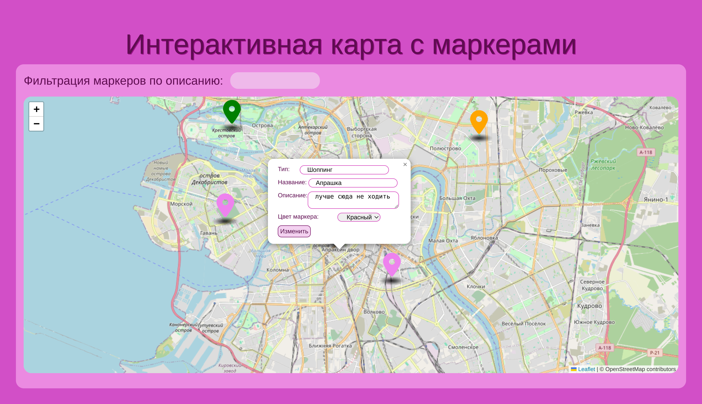
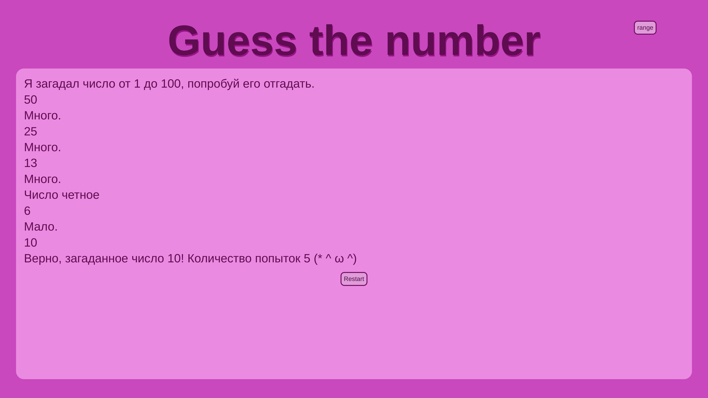
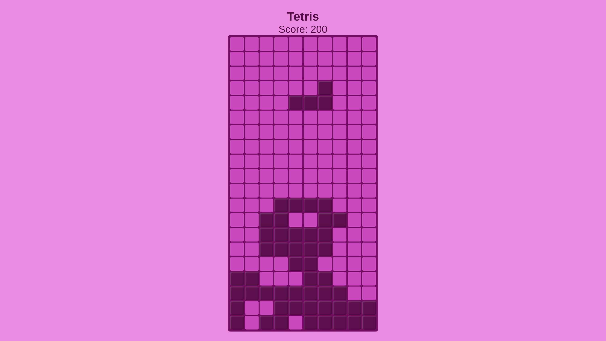
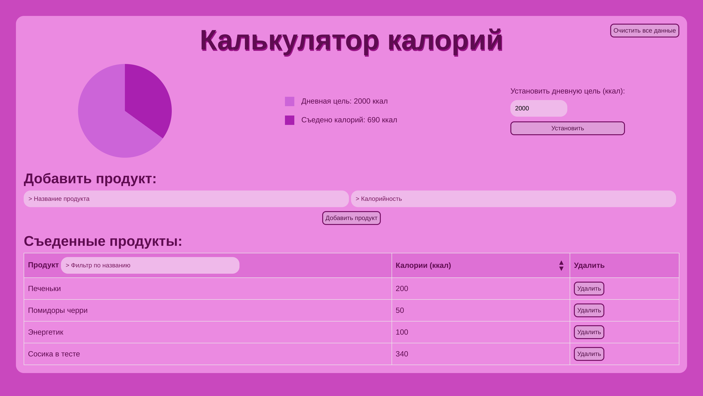
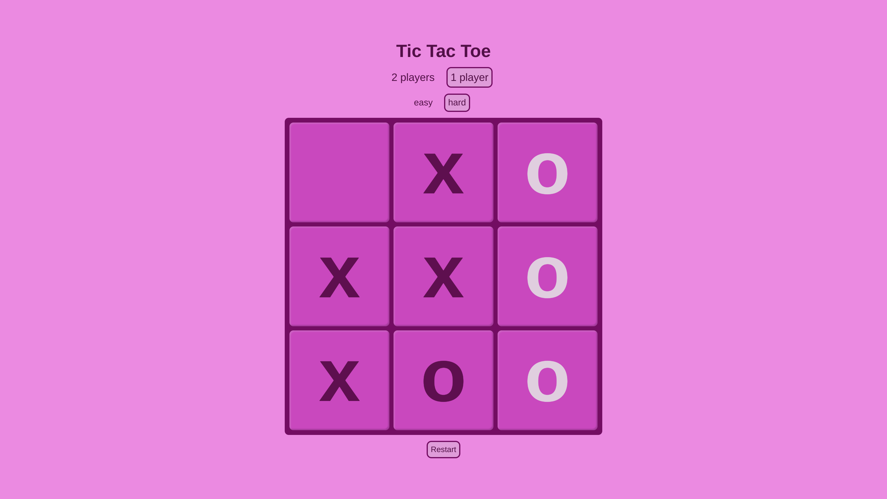

# 💖 Мини-проекты на JavaScript

Этот репозиторий содержит несколько мини-проектов, разработанных на чистом JavaScript. Все проекты доступны для просмотра по [ссылке](https://lolitaklim.github.io/mini-projects-on-js/).

## 🌸 Список проектов

### 1. 🎯 **Интерактивная карта**

Веб-приложение, в котором пользователи могут добавлять, перемещать и редактировать маркеры на карте.

- Реализовано с использованием библиотеки Leaflet.
- Поддержка добавления новых маркеров с информацией (тип, название, описание).
- Возможность редактирования, удаления и перемещения маркеров.
- Маркеры сохраняются в localStorage и загружаются при обновлении страницы.
- Реализована фильтрация маркеров по описанию.

### 2. 🧠 **Игра «Угадай число»**

Интерактивное приложение, в котором компьютер загадывает случайное число, а пользователь пытается его угадать.

- Диапазон от 1 до 100 с возможностью изменения.
- Подсказки после каждых трех неудачных попыток.
- Поддержка перезапуска игры без перезагрузки страницы.
- Счетчик попыток угадывания.

### 3. 🎮 **Игра «Тетрис»**

Классическая игра «Тетрис», где падающие фигуры можно поворачивать и перемещать.

- Система подсчета очков.
- Проверка на конец игры при достижении верхней границы поля.

### 4. 🍽 **Приложение «Калькулятор калорий»**

Приложение для отслеживания потребления калорий в течение дня.

- Возможность добавлять продукты с указанием калорийности.
- Учет съеденных калорий и отображение данных на диаграмме.
- Фильтрация продуктов по названию и сортировка по калорийности.
- Предупреждения при превышении дневного лимита калорий.

### 5. ❌⭕ **Игра «Крестики-нолики»**

Многопользовательская игра на одном устройстве.

- Два режима: игра вдвоем и игра с компьютером (простая и сложная стратегии).
- Определение победителя и возможность начать новую игру.

---
